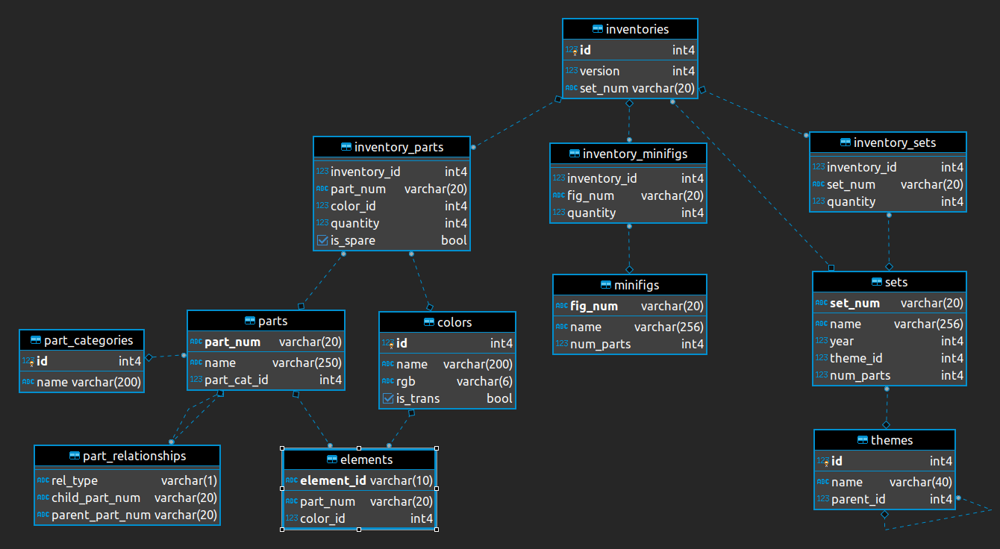

#  Rebrickable Inventories Scraper (bulk downloads)

In addition to an API, [Rebrickable](https://rebrickable.com/") offers their entire catalog of Lego parts, sets, colors, etc. as csv files for bulk download. These files are updated daily.

They also offer LDraw images, grouped by color, for all of the parts in their inventory.

[https://rebrickable.com/downloads/](https://rebrickable.com/downloads/")

## Scraper

This script makes a request for the Rebrickable downloads page, parses the HTML looking for `<a>` tags, and downloads each file with an extension of .zip (LDraw images) or .csv.gz (inventory).

The .zip files go into `/zip` and the .csv.gz files go into `/csv.gz`.

### Requirements

Python 3.x

### Use

Note: All commands are for a MacOS or Linux environment. If you are a Windows user, Google is your friend.

All of the following commands should be run from the command line.

1. Create a `venv` in the project folder:

```
python -m venv venv
```

2. Activate the venv:

```
source venv/bin/activate
```

3. Install requirements:

```
pip install -r requirements.txt
```

4. Run script:

```
python rebrickable-scraper.py
```

Wait a few minutes and all of the files should be downloaded.

As of the time of this writing, there were 12 inventory files (.csv.gz) files and 191 LDraw image files (.zip files).

## Database Schema

They also provide the database schema for the bulk download files:



## YMMV

Things change. Systems get updated. As such, I would highly recommend you take a look at the Rebrickable downloads page before getting too deep into this script.

[https://rebrickable.com/downloads/](https://rebrickable.com/downloads/")
